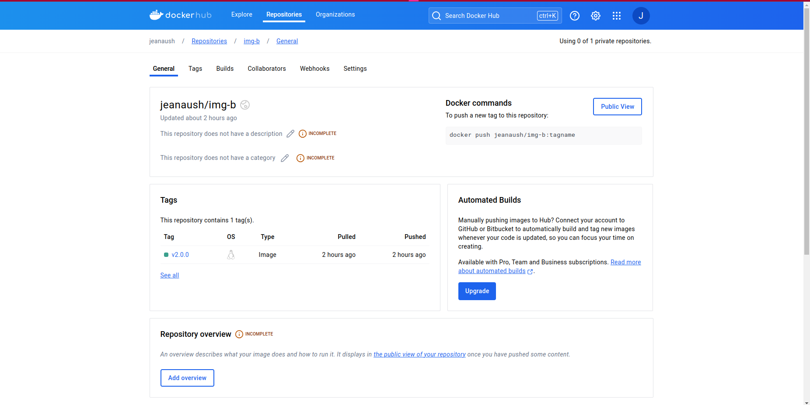

# Containerization Explanation

## 1. Choice of Base Image

For both the frontend and backend containers, we chose `node:18.19.1-alpine` as the base image. This decision was made because:

- Alpine-based images are significantly smaller in size compared to full Node.js images.
- The specific version (18.19.1) ensures consistency across development and production environments.
- Alpine images provide a good balance between size and functionality for Node.js applications.

## 2. Dockerfile Directives

Key directives used in our Dockerfiles include:

- `FROM`: Specifies the base image.
- `WORKDIR`: Sets the working directory inside the container.
- `COPY`: Copies files from the host to the container.
- `RUN`: Executes commands during the build process.
- `EXPOSE`: Informs Docker that the container listens on specified network ports at runtime.
- `CMD`: Provides defaults for an executing container.

Reasoning:
- We use multi-stage builds to separate the build environment from the production environment.
- `npm ci` is used instead of `npm install` in the client dockerfile for more reliable and reproducible builds.
- We clean caches and remove unnecessary files to reduce image size.

## 3. Docker-compose Networking

In our docker-compose.yml file:

- We define a custom bridge network named 'yolo-network'.
- Port mappings are specified for each service (3000 for frontend, 5000 for backend, 27017 for MongoDB).
- All services are connected to the 'yolo-network', allowing inter-container communication.

Reasoning:
- A custom bridge network provides isolation and allows containers to communicate using service names.
- Specific port mappings allow external access to the services while maintaining isolation.

## 4. Docker-compose Volume Definition

We define and use volumes for data persistence:

- `client-volume` for the frontend
- `backend-volume` for the backend
- `mongodb-data` for the MongoDB database

Reasoning:
- Volumes ensure data persistence across container restarts and updates.
- They allow for easier backup and restore processes.

## 5. Git Workflow

For this project, we utilized a simple workflow centered on the master branch:

- All development work was performed directly on the master branch.
- Commits were made frequently to track progress and changes.
- Each commit message clearly describes the changes made or features added.

Reasoning for this approach:
- As this is a smaller project with a single developer, using the master branch exclusively simplifies the workflow.
- Frequent commits on the master branch provide a clear, linear history of the project's development.
- This approach allows for quick iterations and immediate integration of new features or bug fixes.

## 6. Running and Debugging

- We use `docker-compose up` to start all services.
- For debugging, we use Docker logs: `docker logs <container_name>`.
- We've implemented healthchecks in our docker-compose file to ensure services are truly ready.
- We can also start the client with npm start and node server.js for the backend.
- We use mongodb database which is started by 'sudo service mongod start'.

## 7. Docker Image Tagging

We follow these tagging conventions:

- Use semantic versioning (e.g., v1.0.0, v1.1.0). In this case, we used v2.0.0
- Include the type of image (e.g., img-a:v2.0.0, img-b:v2.0.0).

Reasoning:
- Semantic versioning allows for clear understanding of version differences.
- Including image type in the tag improves clarity in multi-container applications.

## 8. DockerHub Deployment

As shown in the screenshot above, our images are properly tagged and available for pull.

Our images are publicly available on DockerHub under the repositories [jeanaush/img-a] and [jeanaush/img-b]